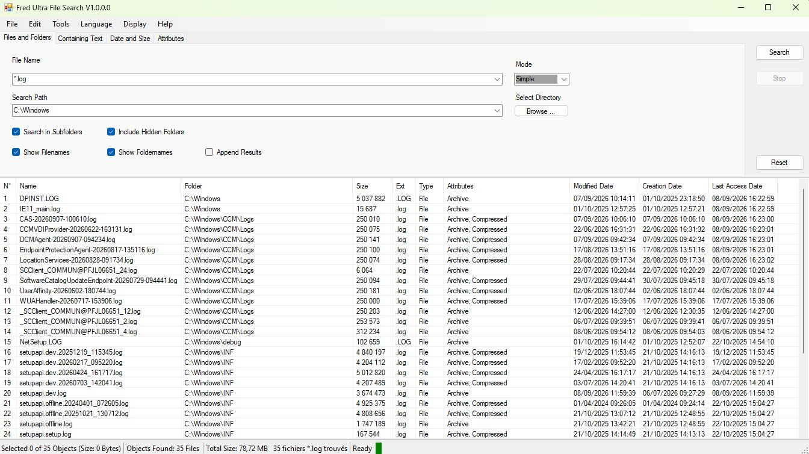

# Fred Ultra File Search

Windows desktop application for searching files on a local computer or server.
Searches can be filtered by file name, date, size, attributes, and file content.

## Features

- Search recursively from a selected starting folder.
- Search by file-name pattern, for example `*.pdf` or `*.jpg`.
- Display results progressively while the search is running.
- Cancel a running search with the **Stop** button.
- Filter by modified date, creation date, and last-access date.
- Filter by file size using bytes, KB, MB, or GB.
- Search file contents by words or phrases.
- Match any or all search terms, with options for case sensitivity, whole words, and exclusion.
- Skip hidden, system, image, audio, or video files.
- Append new results instead of replacing existing results.
- Sort results by clicking a column header. Click the same header again to reverse the sort order.
- Double-click a result to open the file.
- Right-click a result to open the file or its containing directory.
- Resize result columns automatically after a completed search.
- Save search options and window settings between application sessions, including maximized state.

## Usage

1. Enter a file-name pattern in **File and Folders**.
2. Select a starting folder or use **Browse...**.
3. Configure optional filters in **Containing Text** or **Date and Size**.
4. Click **Search**.
5. Use **Stop** to cancel the search while it is running.

When **Append Results** is checked, new matches are added to the existing result list. Otherwise, the previous results are replaced.

## Requirements

- Windows
- .NET Framework 4.8

## Build

Open `FredUltraFileSearch.sln` in Visual Studio and build the solution using the `Debug` or `Release` configuration.

## Français

Application Windows permettant de rechercher des fichiers sur un ordinateur local ou un serveur.
Les recherches peuvent être filtrées par nom, date, taille, attributs et contenu.

### Fonctionnalités

- Recherche récursive à partir d'un dossier sélectionné.
- Recherche par motif de nom de fichier, par exemple `*.pdf` ou `*.jpg`.
- Affichage progressif des résultats pendant la recherche.
- Annulation d'une recherche en cours avec le bouton **Stop**.
- Filtrage par date de modification, de création et de dernier accès.
- Filtrage par taille en octets, KB, MB ou GB.
- Recherche dans le contenu des fichiers par mots ou par phrases.
- Recherche de n'importe quel terme ou de tous les termes, avec options de respect de la casse, de mots entiers et d'exclusion.
- Exclusion des fichiers cachés, système, image, audio ou vidéo.
- Ajout des nouveaux résultats sans remplacer les résultats existants.
- Tri en cliquant sur l'en-tête d'une colonne. Un second clic inverse l'ordre du tri.
- Ouverture d'un fichier par double-clic.
- Ouverture du fichier ou de son dossier parent avec le menu contextuel.
- Ajustement automatique des colonnes après une recherche terminée.
- Sauvegarde des options de recherche et des paramètres de la fenêtre, y compris l'état maximisé.

### Utilisation

1. Saisissez un motif de nom de fichier dans **File and Folders**.
2. Sélectionnez un dossier de départ ou utilisez **Browse...**.
3. Configurez les filtres facultatifs dans **Containing Text** ou **Date and Size**.
4. Cliquez sur **Search**.
5. Utilisez **Stop** pour annuler la recherche en cours.

Lorsque **Append Results** est cochée, les nouveaux résultats sont ajoutés à la liste existante. Sinon, les résultats précédents sont remplacés.

### Prérequis

- Windows
- .NET Framework 4.8

### Compilation

Ouvrez `FredUltraFileSearch.sln` dans Visual Studio, puis compilez la solution avec la configuration `Debug` ou `Release`.
